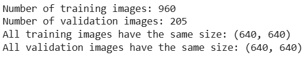
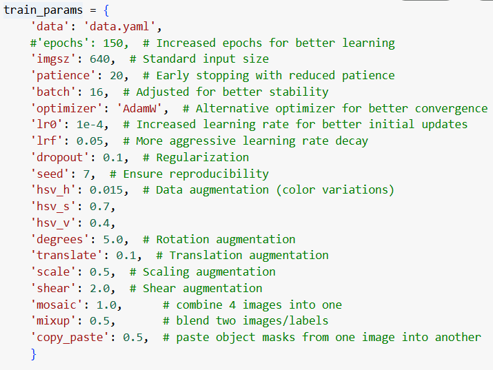
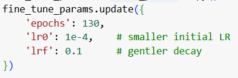
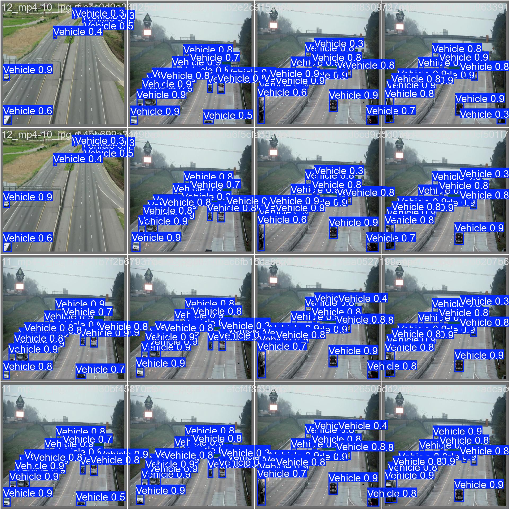
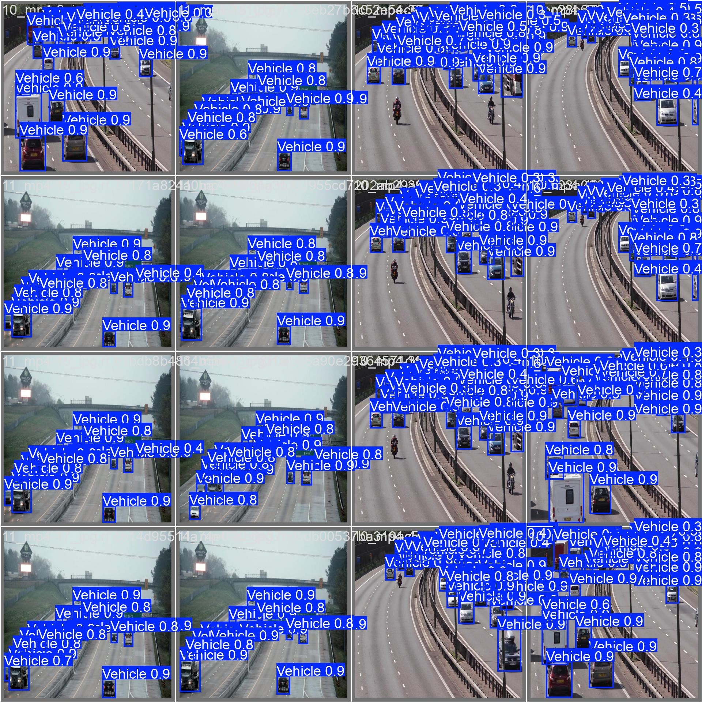
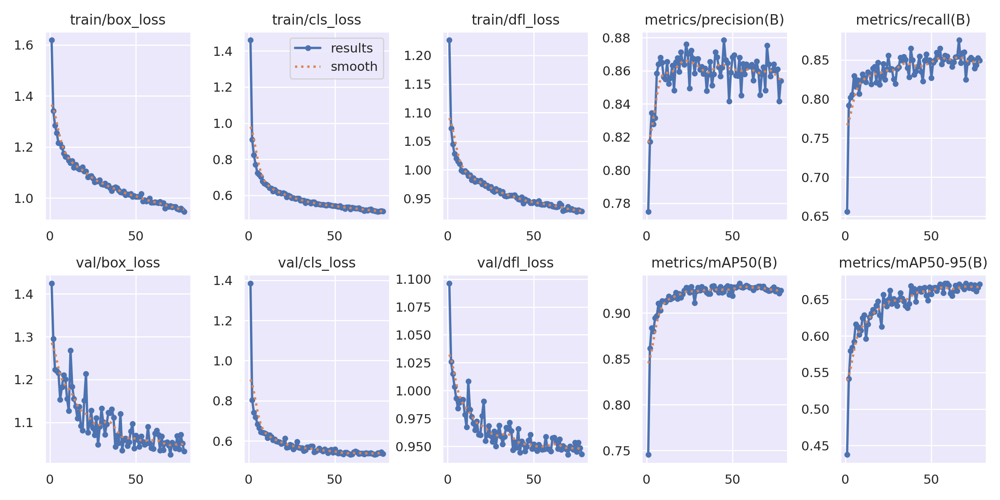
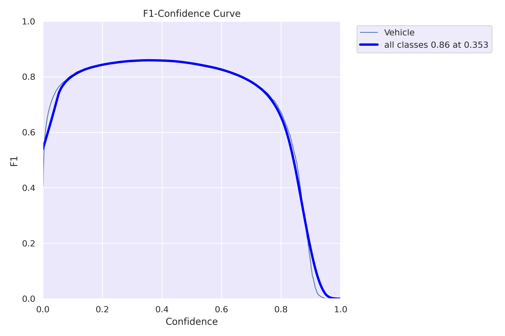

# Project Description

## YouTube Link 
Find our Final Presentation here: [Real-time Lane Traffic Detection](https://youtu.be/V_SqsSwkxNw)

## Overview
This project aims to estimate real-time traffic density using YOLOv8, a state-of-the-art object detection model. By processing video frames or images, the system identifies and counts vehicles in different lanes to determine traffic intensity levels. This approach is beneficial for traffic management, congestion analysis, and urban planning by providing actionable insights into road usage patterns.

## Instructions to reproduce our code
Start with cloning the repository, then follow the following steps:
### 1. Create the virtual environment
  Run this in the terminal:

      python3 -m venv venv
      source venv/bin/activate   ---> For macOS/Linux
      .\venv\Scripts\activate    ---> For Windows
      pip install -r requirements.txt

### 2. Setup dataset paths
  We have uploaded the dataset and written down the corresponding locations in the final notebook.

### 3. Run the notebook
  Our project code is in the notebook code/traffic_density.ipynb. Go to the notebook and run all cells. The output will be stored in the dir -> runs/detect/train.

## Instructions to test our model
Start with cloning the repository, then follow the following steps:
### 1. Create the virtual environment
  Run this in the terminal:

      python3 -m venv venv
      source venv/bin/activate   ---> For macOS/Linux
      .\venv\Scripts\activate    ---> For Windows
      pip install -r requirements.txt

### 2. Setup dataset paths
  We have already set the paths, but you can change it if it is different for you.

### 3. Run the notebook
  Our testing code is in the notebook code/traffic_density_test.ipynb. Go to the notebook and run all cells. The output video will be 'traffic_density_analysis.mp4' and stored in the folder sample_video 

## Visualizations
Given link is the final generated output of our model:
[Visualization](images/output_video.mp4)

## Data Collection
This project aims to estimate real-time traffic density using YOLOv8, an object detection model. By processing video frames or images, the system identifies and counts vehicles in different lanes to determine traffic intensity levels. This approach is beneficial for things like traffic management, congestion analysis, and urban planning.

### Dataset Structure
- **Topview Vehicle Detection Image Dataset** from Kaggle 

  

## Data Processing/Augmentation

- For data pre-processing, all the images in the dataset were resized to a standard 640x640.
  Following this, the images were:
  - **Flipped horizontally** 
  - **Image crop** of 0-20% was applied, and 
  - **Brightness** was varied between 0-15% lighter or darker. 
  This increased the overall size of the dataset to 960 training and 205 validation images (82-18% train-val split).

### Training Process
- **Hyperparameters**: 
  We used the following parameters to run the YOLOv8n head for 20 epochs:
  
  
  Then we fine tuned the entire YOLOv8 model by updating the following parameters and running it for 130 more epochs:
  
  

- **Loss Functions**:
  - **Box Loss**: Measuring bounding box regression accuracy.
  - **Classification Loss**: Measures class prediction accuracy.
  - **Distribution Focal Loss**: Handling class imbalance.

### Model Evaluation
- **Key Metrics**:
  - **Precision**: Ratio of TP to positive predictions.
  - **Recall**: Ratio of TP to all actual predictions.
  - **mAP@0.5**: Mean Average Precision at IoU threshold of 0.5.
  - **mAP@0.5:0.95**: Mean Average Precision across IoU threshold of 0.5 to 0.95.

## Vehicle Detection and Lane Identification
We identify vehicles within each frame using YOLO. We first isolate the region of interest (ROI) in the frame, typically focusing on the lanes of interest, using a mask to eliminate irrelevant areas. This can be done by blacking out the regions outside the specific vertical range of the lanes, ensuring that only the lanes are considered for vehicle counting.
 

  
After applying the detection model, bounding boxes are drawn around the vehicles, and their characteristics—such as size, position, and movement—are extracted. These boxes are then used to track vehicle movements, which helps estimate vehicle speeds and lane occupancy.
 
  
## Traffic Density Estimation
The system calculates the number of vehicles in each lane based on detected bounding boxes.

- **Traffic density is estimated by a predefined threshold of 4 for vehicle counts**:
  - **High vehicle count**: The lane is classified as having "Heavy" traffic.
  - **Low vehicle count**: The lane is classified as having "Smooth" traffic.
- The system continuously updates traffic density estimations in real-time as new frames are processed.
- The density estimation algorithm ensures minimal errors by filtering out false detections and considering factors like vehicle occlusion and lighting conditions.

## Real-Time Feedback
The system processes video frames dynamically, providing real-time updates on traffic density.

- A dashboard or interface can display:
  - A Real-time bounding box visualization of detected vehicles.
  - Lane-wise vehicle counts for easy traffic assessment.
  - Current traffic intensity classification for each lane.
- Data visualization tools such as Matplotlib and OpenCV assist in interpreting traffic patterns and trends over time.
- The system can be integrated with traffic control centers to trigger alerts for congestion-prone areas, allowing for better traffic management and planning.

## Results
 

  

After fine-tuning, the YOLOv8 model got better at predicting correct classes for the images (highlighting vehicles detected with bounding boxes) in a large variety of different scenarios – multiple camera views, different types of roads, varying traffic and lighting conditions.
 

  

- The loss curves (box loss, classification loss, and distribution focal loss) show that the learning is effective and there is no overfitting.
- Precision and recall are stable at approximately 0.8, showing that the model is identifying vehicles with high accuracy.
- mAP50, mAP50-95 show that the model is performing strongly and is reliable across multiple confidence thresholds.

### F1 Confidence Curve
 

  

- The graph shows the F1 Confidence curve for the classes.
- The optimal **F1 score is 0.86 at a confidence threshold of 0.353**.
- The curve maintains high F1 scores (above 0.8) across a wide range of confidence thresholds (approx. 0.1 - 0.8), indicating robustness and consistency for real-world deployment scenarios.
